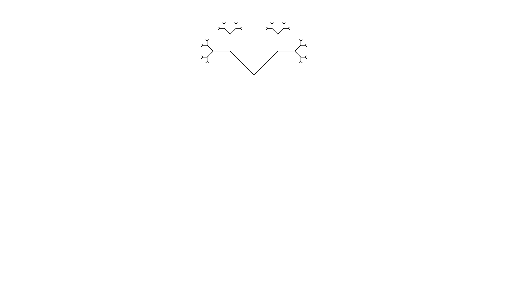

# Synthesis
L-systems are like a brush that allow you to paint beautiful forms. But like any
form of art it takes practice to become proficient. This chapter will allow you
to take a peek behind the curtain. It will provide a few hints and tips when
trying to create an L-system to resemble an image.

## Target image


Look at the above image. How would an L-system look like that would recreate
that image?

## Configuration
### Step
Step is less critical for the image so any starting value that allows you to see
forwards clearly will do. Usually I settle on 30 and work from there

### Angle
Take a look at some of the angles in the image. The angle between the main trunk
and the first branches seems to be 45 degrees. Looking at other junctions the
angle of 45 degrees seems to be found a lot.

Keep in mind that the configuration could have a different angle configured. It
is only necessary that a series of plusses or minusses can create an angle of 45
degrees. E.g. an angle of 90 degrees can be made with an base angle of 45 by
turning twice in a row.

### L-system file
Start a file `tree.ls` in the `system` directory. We can already provide one of
the sections

```plain
config:
step = 30
angle = 45
```

## Rules
### Axiom
Ferris the crab will start heading to the right. Since the main trunk grows
upward we need to first orient Ferris before they can start drawing. Luckily 90
is a multiple of 45 so two left turns will start us off right away.

To get some feedback if we are on the right track we could add the rules section
and the following axiom.

```plain
rules:
axiom = --F
```

Execute `cargo run -- -f system/tree.ls -n 0` to see a mighty trunk.

### Rules
When we focus on the rules and look at the tree, we notice that from the trunk
two branches sprout. Since Ferris can't lift the pen from the paper, we know
from the junction that we need to branch.

Let's try our hand. After each forward we will split in two. In one part we turn
left and sprout an new tree. In the other part we turn right and sprout a new
tree. After a moments thought we might come up with the following rule.

```plain
F => F[-F][+F]
```

Add the rule to the L-system and run it to see the result. Don't forget to
change the number of iterations.

### Lengthening the stems
Seeing the image being drawn be Ferris, we notice that the structure is correct,
but the length of the stems are off. Taking a closer look the stems seem to grow
shorter for each new branch.

Thinking about this some more, this would occur naturally if each forward step
would change into two ore more forwards step with each iteration. That would
suggest 

```plain
F => FF
```

Since we already used `F` we need to introduce a new symbol. Let's settle on `S`
which will stand for seed.

The axiom needs to change into `--S`, i.e. change orientation and plant a seed.
Next, each seed will grow into a stem and sprout two new seeds, both growing in
a different direction. I.e. `S => F[-S][+S]`.
Lastly during each iteration the stems need to grow, which corresponds to the 
`F => FF` rule.

Change the rules and check the result.

## Optimization 
We have successfully recreated the image. But there is an optimization that
could be performed. Think about the second pair of brackets in the 
`S => F[-S][+S]` rule.

We use a pair of brackets to return to the exact state Ferris was in when we
opened the bracket upon closing the bracket pair. We usually do this because we
want to draw something else from that location. But we aren't drawing anything
after the second branch.

Check that `S => F[-S]+S` results in the same image.

## Exercises
1. Walk through this chapter and recreate the image.
2. If you would want to delay the growth of the stems, how would you do that?


